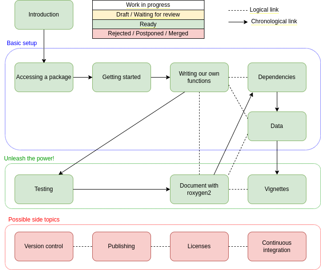

# Packaging with R

**Thanks for contributing to The Carpentries Incubator!**
This repository provides a blank starting point for lessons to be developed here.

A member of the [Carpentries Curriculum Team](https://carpentries.org/team/)
will work with you to get your lesson listed on the
[Community Developed Lessons page][community-lessons]
and make sure you have everything you need to begin developing your new lesson.

## Current status

Source [here](https://drive.google.com/file/d/1v4s5pZE6unPlrqsB5DLN1kGLkrVNBX8e/view?usp=sharing).

## What to do next

* [ ] Keep writing content.
* [ ] Find reviewers to curate content.
* [ ] Think about the two problems our example has:
    1. It doesn't require dependencies.
    2. The vignette will look like a manual, not like research.
* [ ] Decide if _Getting started_ shall precede _Accessing package_.
* [ ] Consider adding a _Developing workflow_ episode after _Documenting with roxygen2_ episode.
    * To show that code is alive.
    * To show how testing helps us finding new desirable features.
* [ ] Decide about possible side topics.
    * Do we want to teach git here or in an independent module?

## Activity log

### Early autumn sprint
20-23 September 2021. Pablo Rodríguez-Sánchez, Mateusz Kuzak
### Summer sprint
9-13 August 2021. Pablo Rodríguez-Sánchez, Lieke de Boer

- Write 6 episodes
    - Introduction
    - Accessing packages
    - Getting started
    - Writing our own functions
    - Testing
    - Documenting your package
- Include figures and animations generated with [Peek](https://github.com/phw/peek)
- Start merging contents into main branch
    - The one chapter - one branch approach proved to not be a good idea
- Adapt initial plans to challenges discovered while writing and trying
- Use `README` for keeping members updated
    - Draw a _Current Status_ diagram
    - Add a _what to do next_ section
    - Add this _Activity log_
- Add `_meta` files
    - And create a related pull request in [next-lesson-template](https://github.com/esciencecenter-digital-skills/next-lesson-template/pull/4).

### Kick-off 2021
31 May - 4 June 2021. Pablo Rodríguez-Sánchez, Barbara Vreede, Mateusz Kuzak

- Brainstorm and plan the tentative structure
- Read the materials

## Contributing

We welcome all contributions to improve the lesson! Maintainers will do their best to help you if you have any
questions, concerns, or experience any difficulties along the way.

We'd like to ask you to familiarize yourself with our [Contribution Guide](CONTRIBUTING.md) and have a look at
the [more detailed guidelines][lesson-example] on proper formatting, ways to render the lesson locally, and even
how to write new episodes.

Please see the current list of [issues](https://github.com/escience-academy/lesson-R-packaging/issues) for ideas for contributing to this
repository. For making your contribution, we use the GitHub flow, which is
nicely explained in the chapter [Contributing to a Project](http://git-scm.com/book/en/v2/GitHub-Contributing-to-a-Project) in Pro Git
by Scott Chacon.
Look for the tag . This indicates that the maintainers will welcome a pull request fixing this issue.

## Maintainer(s)

Current maintainers of this lesson are

* Barbara Vreede [@bvreede](https://github.com/bvreede)
* Johan Hidding [@jhidding](https://github.com/jhidding)
* Pablo Rodríguez-Sánchez [@PabRod](https://github.com/PabRod/)

## Authors

A list of contributors to the lesson can be found in [AUTHORS](AUTHORS)

## Citation

To cite this lesson, please consult with [CITATION](CITATION)

[cdh]: https://cdh.carpentries.org
[change-default-branch]: https://docs.github.com/en/github/administering-a-repository/changing-the-default-branch
[community-lessons]: https://carpentries.org/community-lessons
[lesson-example]: https://carpentries.github.io/lesson-example
