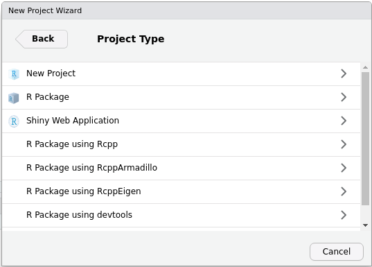
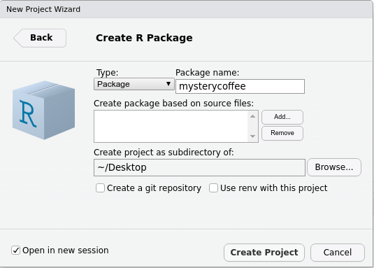

## A minimal package

The menus in `RStudio` will help us greatly, also for creating a package.
If you open `RStudio`, look at the upper left corner and press `File > New project > New directory`, you'll see a menu like this:

As you can guess, now we'll press `R package`.
The new menu asks us to fill some information.
For the moment, just stay with me and fill it like this:

Notice that:

- We gave the package a name: `mysterycoffee`.
- I created my package on my `~/Desktop` folder, but you can use another location if you prefer.
- We ticked `Create git repository`. We'll be back to `git` on episode FIXME.
- We left `Use renv with this project unticked`.
- We ticked `Open in new session`.

Now we are ready to press `Create Project`.

> ## What did just happen?
> After pressing `Create Project`, a new `RStudio` window should have appeared.
> The working folder should be `mysterycoffee`, and it should already have some contents:
> 
> 
>
> Also, the file `./R/hello.R` would appear open in the editor.
> This is an example file that will help you writing your first packaged R functions.
{: .callout}

> ## The `hello.R` file
> Take a look at the `hello.R` file.
> You'll see that it contains a tiny function and some comments.
> The comments are actually more important that the function itself.
> They contain very useful tips about how to install, check and test the package.
{: .callout}
> ## The `DESCRIPTION` file
> Open the `DESCRIPTION` file.
> What do you see here?
>
> Take 5 minutes to edit this file with the information it asks.
{: .callout}


