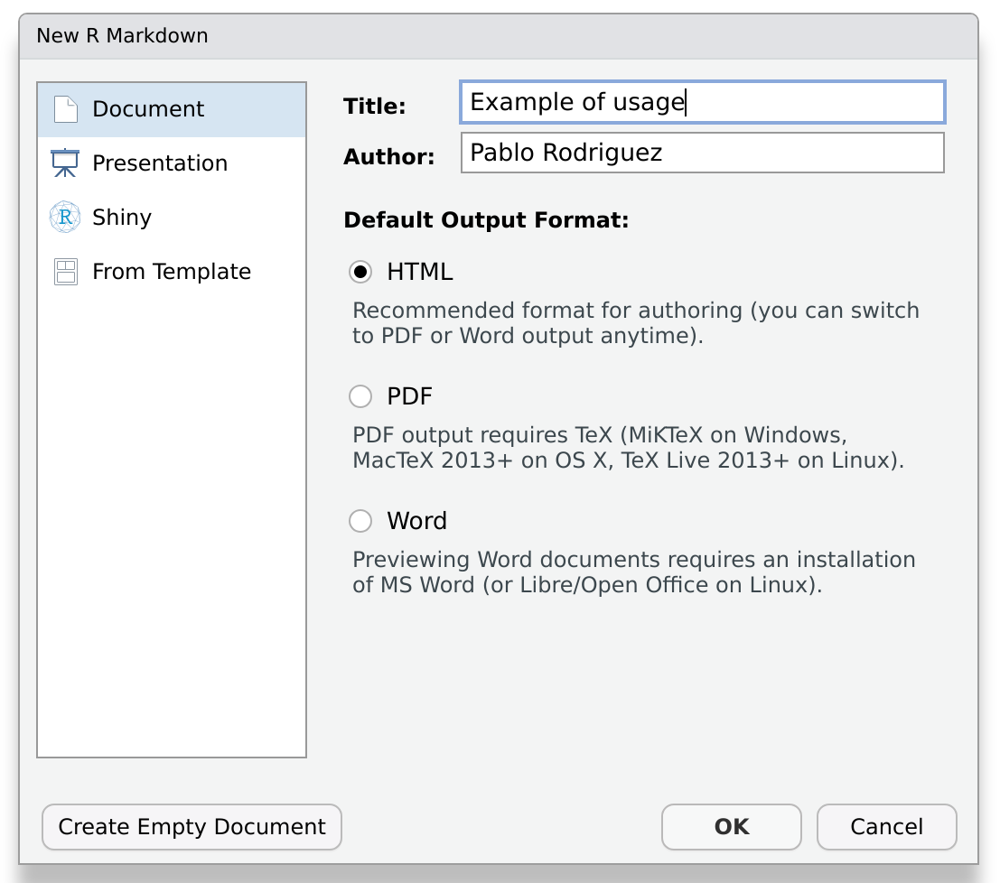

## Vignettes

If you are reading this, chances are that you are using R for doing research.
And if you are a researcher, probably you spend a lot of time writing.
Did you know that you can write your reports, and even your papers, directly from R?

We'll do this with vignettes.
Vignettes are plain-text files that combine enriched text and code.
Typically, the enriched text is displayed and the code is hidden and executed.

Think about it for a moment.
A vignette will take code from your package, execute it, generate the figures for you, and put everything together and in context.
The resulting document would be a human readable website, pdf file or even Microsoft Word file.

> ## Why would you want to do that?!
> Writing your reports directly in R Studio may sound like an overkill, and it is certainly a bit harder than writing on an external word processor.
> Can you think of a couple of reasons for making the effort worth it?
>
> > ## Solution
> > There are several reasons that make the use of vignettes a very good idea for writing research.
> > For instance:
> > - It keeps all the work tidy in a single project folder.
> > - The document describes and performs the calculations, instead of only describing them.
> > - The document can be read as a text, but interested enough readers can also execute it, test it. In short: reproduce it.
> {: .solution}
{: .challenge}

> ## Why is everybody talking about reproducibility?
> Probably you've heard about it.
> The [reproducibility crisis](https://en.wikipedia.org/wiki/Replication_crisis) has been in the headlines recently.
> In short, reproducibility crisis means that the results of many scientific studies are difficult or impossible to reproduce in an independent lab (and often even at the same lab they were produced!).
> 
> And why is this relevant?
> Because reproducibility is a cornerstone of the scientific method.
> It can be argued that non-reproducible results are literally not scientific.
{: .callout}

## `Rmarkdown` files

In `R`, vignettes are typically written using `.Rmd` (a shortening of `Rmarkdown`) files.
The name is self-descriptive: it is a file that combines **code** (in `R`) and **text** (in `markdown`).

> ## What is markdown?
> Markdown is a way of creating formatted text using a plain-text editor.
> Actually, it looks a lot like plain text, but with some special symbols every now and then indicating aesthetic details such as bold typeface, links, tables, ...
> Markdown files can be rendered to reading-friendly formats, such as `html` or `pdf`.
> 
> This website is written in markdown.
> Below you can the source for the last paragraph of the previous section.
> 
> ~~~markdown
> In `R`, vignettes are typically written using `.Rmd` (a shortening of `Rmarkdown`) files.
> The name is self-descriptive: it is a file that combines **code** (in `R`) and **text** (in `markdown`).
> ~~~
> {: .code}
> 
> The good news is you don't have to learn by hearth all these symbols.
> As we'll see below, RStudio is going to help you a lot in this regard.
> Additionally, there are lots of good [cheat sheets](https://www.markdownguide.org/cheat-sheet/) available online.
{: .callout}

We can easily create our first vignette using the RStudio menus.
Click on `File/New file/R Markdown`, and you'll see a window like the one below:

Fill in the field `Title` with the text: "Examples of usage", and press `OK`.

A new file will appear.
Before going further, let's save it.
Create a folder inside your project with the name `vignettes`, and save it there with the name `examples.Rmd`.

Now, let's take a look at the file.
Notice that the new file is not empty.
This is great!
RStudio created an example for us!

As always, it is instructive to read the message (in this case, the file) that RStudio generated for us.
We realize that:
- Several formatting options are present as examples (so we don't have to remember them!).
- Code blocks are surrounded by the symbol \`\`\`{r} and end with \`\`\`.
- There is something called **knit** that seems to be important.

_"Knitting"_ is the process of generating a reader-friendly document.
And RStudio has a button for that.
Let's press it and see what happens.

Great, isn't it?

> ## Can I knit markdown files to other formats than html?
> Yes, and surprisingly easy indeed.
> Just take a look a the expanded menu of the knitting button.
>
> Be warned, anyways, that some output formats may require installing additional packages.
{: .callout}
> ## Can I use vignettes with other language than R?
> Yes, although this is advanced material that we'll not cover in detail in this course.
>
{: .callout}


