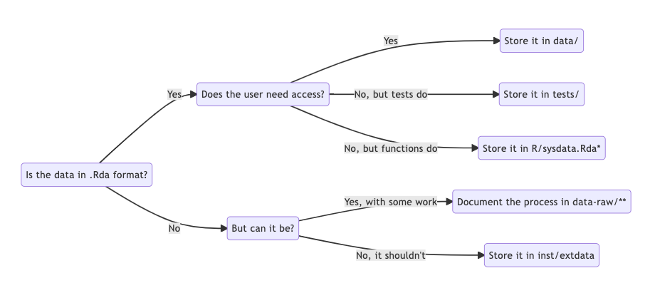

# Agenda

1. Introduction
2. Accessing packages
3. Getting started
4. Writing our own functions
5. Licenses
6. Testing
7. Managing dependencies
8. Documenting your package
9. Data
10. Vignettes

# Introduction

::: overview
## Questions

- What is a package?
- Why do we want a package?
:::

::: overview
## Objectives

- Understand what a package is.
- Understand why a package is useful.
- Understand the tools you are about to use.
:::

## What is a package and what is it good for?

* Robustness
* Reproducibility
* Shareability
* Legibility
* Usability
* Maintainability

::: discussion
## Discussion - How can this course help me?

As we will see during this course, applying a standardized structure
comes with several unexpected benefits. Let me ask you a few questions:

- Did you ever have problems running a script written by a colleague?
- Did you ever have problems running your own code?
- Are you sometimes scared of editing your code, just in case you
  "break" it?
- Do you suspect that some parts of your code may not be working as you
  want them to?
- Do you feel that you are losing control about how your code is
  growing?

If your answer to any of the previous questions is yes, stay with us.
You may not know it yet, but software packaging can make your life
easier.

Can anyone give an example of these things happening to them in their
work?
:::


# Accessing packages

::: overview
## Questions

- How do I use someone else's package?
- How do I use my own package?
- What is the difference between installing and attaching?
:::

::: overview
## Objectives

- Install packages from CRAN
- Install packages from other locations, such as GitHub
- Build, install and attach your own packages
:::

:::: challenge
## Challenge - Install a package from a repository

Find an R package on a public repository, such as
[GitHub](https://github.com) or [GitLab](https://gitlab.com), and
install it with devtools.

If you have trouble finding a package, you can try:

- From GitHub:
  [github.com/Lchiffon/wordcloud2](https://github.com/Lchiffon/wordcloud2)
- From GitLab:
  [gitlab.com/r-packages/psyverse](https://gitlab.com/r-packages/psyverse)

For an extra challenge: try to install them using different functions.

::: hint
Hint: the function `devtools::install_git()` applies to any git
repository.
:::
::::

::: challenge
## Challenge - Why would you want to install a package from GitHub?

Can you think of a situation where you would rather install from GitHub
than from CRAN?
:::

::: challenge
## Challenge - To attach or not to attach?

If you are developing a package that depends on other packages, you will
probably need to call functions from other packages. These functions
will be used in the functions of your own package. When you do this, you
should call functions from the other packages using the syntax
`<package>::<function>`, and *not* by using `library(<package>)` inside
a package.

Do you have any idea why?
:::


# Getting started

::: overview
## Questions

- "I want to write a package. Where should I start?"
:::

::: overview
## Objectives

- "Create a minimal package"
:::


::: challenge
## Challenge - Try out the `hello()` function. Edit it, and reload the package.

1.  What does it print?
2.  Change this function to generate a different output. (Have fun with
    it, perhaps add an argument or two!)
3.  Build and install the package, and call the function again to see
    that it works differently.
:::

::: discussion
## Discussion - Tell me how you load your functions

There are many ways of using functions, but all of them involve loading
them into the workspace. We just learned how to do that using a package.

**How do you usually work with functions?** Perhaps you source them from
an external file? Do you usually work on a single, long script?

**Can you think of any advantage of using packages instead?** Don't
worry if the answer is no. This is actually a difficult question at this
stage. We'll show the full power of packages along the course.
:::

## More advanced folder structures
In this course we will show you how to unleash the full power of packaging.
In order to do so, we will use some optional folders.
You can see an overview below

```
.
├── R
│   └── <R functions>
├── data (optional)
│   └── <data>
├── tests (optional)
│   ├── testthat.R
│   └── testthat
│       └── <tests>
├── vignettes (optional)
│   └── <Rmd vignettes>
├── inst (optional)
│   └── <any other files>
├── README.md
├── LICENSE
├── DESCRIPTION
└── NAMESPACE
```

# Writing our own functions

::: overview
## Questions

- "How can I add functionality to my package?"
:::

::: overview
## Objectives

- "Create a custom package"
:::

## Mystery Coffee

1. What will our package do? Simulate random encounters between employees.
2. How will we do it?
  * Input: vector of employees’ names.
  * Output: a two-column matrix, randomly grouping the employees’ names into couples.
3. Are we reinventing the wheel? Yes

::: challenge
## Challenge - The `DESCRIPTION` file

Open the `DESCRIPTION` file. What do you see here?

Take 5 minutes to edit this file with the information it asks. In
particular, edit the following fields (when needed): `Title`, `Version`,
`Author`, `Maintainer`, `Description`. For now, ignore the rest.
:::


# Licenses

::: overview
## Questions

- How do I allow the use of my package?
:::

::: overview
## Objectives

- Understand the reason for licenses
- Learn how to add a license to a new R package
:::

::: challenge
## Challenge - Adding and changing the license of the package

1.  Using the `usethis` package, apply an Apache license to your
    package. For help, see [this
    link](https://usethis.r-lib.org/reference/index.html#package-setup).
2.  In the root directory of your project, which files have changed? How
    have they changed?
3.  Change the license of your package to the license you want to use.
    Which function did you use?
:::


# Testing

::: overview
## Questions

- How can I know that my package works as expected?
:::

::: overview
## Objectives

- Understand why tests are useful
- Learn how to create a battery of basic tests
- Learn how to run the tests
- Learn to not panic if a test fails
- Optional: Learn how to perform a code check
:::

::: discussion
## Discussion - What happened?

Take a look at the output of `usethis::use_testthat()`. Take also a look
at your folder system (press the refresh button if needed).

What happened?
:::

::: discussion
## Discussion - Why are we not attaching `usethis`?

In the example above, we used:

``` r
usethis::use_testthat() # Recommended
```

but we could have also used:

``` r
library(usethis)
use_testthat() # Correct, but not recommended
```

Do you have any idea why? Are the two code snippets above not
equivalent?
:::

::: challenge
## Challenge - Write your own test

Let's follow the advice printed in the console and modify the file
`tests/testthat/test-functions.R`. In order to do this, we first have to
open it and take a look at its contents. It should contain something
like this:

``` r
test_that("multiplication works", {
  expect_equal(2 * 2, 4)
})
```

This is just an example test, that was created to make your life easier.
You can use it as a template for writing your own tests. Take 10 minutes
to: 1. Figure out what is happening inside this test. Can you understand
it? 2. Write another test, just below this one, that checks that
addition also works. Tip: you can copy-paste and edit the current test.
:::

::: challenge
## Challenge - Automated vs manual testing

Take a look at the test above, and compare it to the manual test we did
at the beginning of this episode. What differences do you see?
:::

::: challenge
## Challenge - Test shape

Now it is your turn to write a test. Using the same input as in the
previous examples, I want you to check that the output is a matrix with
3 rows and 2 columns.

Tip 1: tests can contain multiple assertions.

Tip 2: the functions `nrow` and `ncol` may come in handy.
:::

::: challenge
## Challenge - Uneven mysterycoffee

Write new a test that passes an uneven number of names to `make_groups`.

You can use our previous test, the one we called *"number of elements"*,
as a template, and adapt it to accept a list with one more name. This
should be a new, additional test, so please copypaste it, don't delete
it.

Run the tests again. What happened?
:::

::: discussion
## Discussion - What shall we do now?

So, thanks to our test, we discovered a possible problem in our
function. What shall we do now?

There are several possibilities. We can leave the function just as it
is, and modify the test to assert that a warning is thrown. We can
forbid the user to introduce any number that is not even, and throw an
error otherwise. Maybe we can come up with an improved function that
fixes this.

All of them are reasonable possibilities. Just keep one thing in mind:
whatever change we make, it ideally shouldn't affect the tests that we
already wrote!

What would be your preferred solution?
:::

::: challenge
## Challenge - What is the added value of automated testing?

Storing tests in the form of a script takes a bit more time and effort
than just running them interactively in the console.

Do you have any idea about why is it worth the effort?
:::

::: discussion
## Discussion - Checking vs testing

When we check we perform the tests, and much more. In that sense, we can
say that checking is better than testing. Why would you want to test
instead? When would you test, and when would you check?
:::


# Managing dependencies

::: overview
## Questions

- How can I make my package as easy to install as possible?
:::

::: overview
## Objectives

- Use the `DESCRIPTION` file for declaring dependencies
:::

:::: challenge
## Challenge - Add some dependencies

Let's add some dependencies to this list. Particularly, we want you to
add:

- `knitr` as an mandatory dependency.
- `tidyr` as a recommended dependency.

::: hint
Tip: take a look at the help menu of `usethis::use_package()`.
:::
::::

---

::: challenge
## Challenge - Check your dependencies
With this in place, or with your own package, do the following. Run
`devtools::check()` (or click [ Build ] > [ Check ]). What messages
do you get about dependencies? Optionally, you can address the messages
by changing the code, and re-run `devtools::check()` to see if you were
successful.
:::


# Documenting your package

::: overview
## Questions

- How can I make my package understandable and reusable?
:::

::: overview
## Objectives

- Write a readme
- Use roxygen2 for creating documentation
- Use roxygen2 for managing the NAMESPACE file
:::

::: discussion
## Discussion - What do you want to tell your potential users?

Try to put yourself in the shoes of your potential users. They can be
collaborators, people who found you code on the internet, ...

What do you think they would like to know?

Now, take a look at the [README from
github.com/PabRod/kinematics](https://github.com/PabRod/kinematics).

What subjects are addressed in this README? As a potential user, is
there anything that you miss?

With the results of this discussion, write a short README file for our
package.

Get started with `usethis::use_readme_md()` to generate a default
README.md file.
:::

::: challenge
## Challenge - Write the docs

Take 5 minutes to edit the skeleton with real documentation. In
particular:

1.  Add a title.
2.  Describe, below the title, what the function does.
3.  Describe the parameter `names`.
4.  Describe the output that is returned.
5.  Ignore `@export`.
6.  Delete `@examples`.
:::

::: challenge
## Challenge - The `export` field

In case you don't want your function to be directly accessible for users
of your package, you just have to delete the `@export` keyword from the
function documentation. But, why would you want that? Can you think of
an example where hiding a function can be a good idea?
:::

::: challenge
## Challenge - Writing the `NAMESPACE`

The documentation build also created the `NAMESPACE` file. Can you open
it and describe what do you see? What does it mean?
:::


# Data

::: overview
## Questions

- How can I include data in my package?
:::

::: overview
## Objectives

- Learn how to use the data folder
:::

## Challenge - What happened?

::: challenge
Type and execute in your console the code we just showed. What does it
do? Does it require any further action from our side?
:::

## Discussion - Raw Data

::: discussion
When do you think is it useful for a package to include data that do not
have the `.rda` or `.RData` extensions?
:::

## Summary




# Vignettes

::: overview
## Questions

- I have written the functions in my package, but can I also use them?
- How can I write a tutorial or paper as part of my package?
:::

::: overview
## Objectives

- Learn how to write reports in the form of a vignette, using R
  Markdown.
:::

::: challenge
## Challenge - Explore vignettes

Take some time to explore the vignette(s) of your favorite package(s).
What things do you notice? What properties of vignettes stand out to
you?
:::

::: challenge
## Challenge - A vignette about `mysterycoffee`

For this exercise, add code chunks and markdown text to make the
vignette complete. Think about what a user may want to know when first
encountering the `mysterycoffee` package.

You can think about the following elements:

- Describe the purpose of the package (markdown)
- Show how to attach the package (a code chunk)
- Show how to load some names (a code chunk)
- Use the `make_groups` function on the names, to make the groups (a
  code chunk)
- Display the groups formed after running `make_groups` (a code chunk)
- Explanatory text in between the chunks, to narrate the process
  (markdown)
:::
